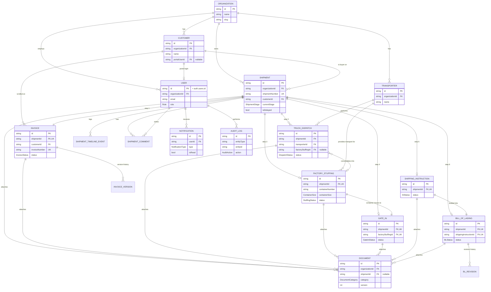

# ExFlow — Entity Relationship Diagram

Source of truth is [`prisma/schema.prisma`](../prisma/schema.prisma). This diagram is a
readable companion, not a substitute — column lists here are trimmed to the fields that
matter for relationships and workflow status.

## Notes on modeling decisions

- **One `Shipment` = one container / one pipeline instance.** `Invoice` is 1:1 with
  `Shipment` (creating an invoice creates its shipment). `TruckDispatch` is many:1 with
  `Shipment` because multiple partial truckloads commonly consolidate into a single
  stuffed container — each dispatch can optionally link to the `FactoryStuffing` it fed.
- `FactoryStuffing`, `GateIn`, `ShippingInstruction`, and `BillOfLading` are 1:1 with
  `Shipment` for v1. Amendments/revisions are modeled as history rows
  (`InvoiceVersion`, `BLRevision`) rather than new parent rows.
- `Document` is a single polymorphic table (`shipmentId` + optional per-module FK) so
  uploads, OCR text, and version chains work the same way across every module instead of
  duplicating an uploads table six times.
- `Customer.portalUserId` is the only link between the master-data side and Supabase
  Auth users for the customer portal; everyone else authenticates as a `User` scoped to
  an `Organization`.
- Multi-tenancy is enforced twice: application-layer (`organizationId` checks in every
  Prisma query, done in Server Actions) and database-layer (Postgres RLS policies in
  `prisma/migrations/0002_auth_rls`) as defense-in-depth for any direct Supabase client
  access.
